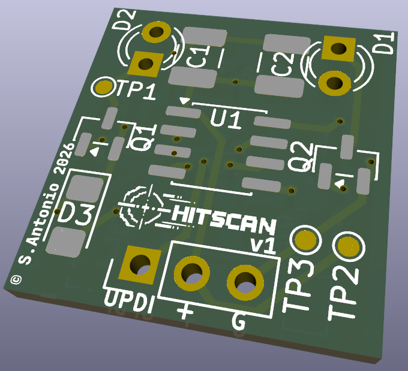

# Project Hitscan

An attempt at a super cheap time keeping system for racers
It uses IR diodes on a drone, and a detection station to track when the drone passes the detector.

*Should?* be good at up to speeds of 200km/hr with a 200mm detection window - (need to actually validate this)

### IR Details
**Packet timing now:**

* SYNC: 270μs burst + 900μs gap = 1170μs
* 3 bits: ~300-600μs each = ~1200μs average
* **Total: ~2.3ms per packet**

**At 200mm cone width:**

* 100 km/hr (27.78 m/s): 7.2ms window = 3 packets ✅
* 150 km/hr (41.67 m/s): 4.8ms window = 2 packets ✅
* 200 km/hr: 3.6ms window = 1 packet ✅

> [!CAUTION]
> In development

Initial project is currently in the mail from the board fab.

## Tools

* Kicad 9.0 for board development
* PlatformIO for firmware builds and deployment

## Firmware
* [Base station](./hitscan-base/README.MD)
* [IR Blaster](./hitscan/README.MD)

### Web App

## Hardware
