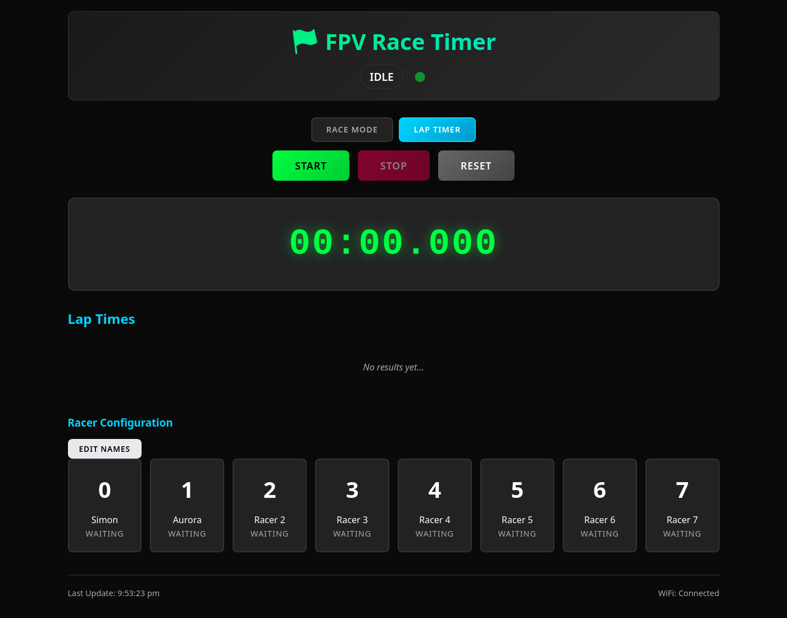

# Hitscan base station

Runs on an ESP32 with Audio feedback, LED lights for status's and web app for tracking lap times
Mount your hitscan pcb on your quad with led's facing left/right on the quad. So tracking will work in either direction



> [!NOTE]
> Requires a 3d model (to be designed)

> [!WARNING]
> to be validated with actual hardware (PCB is in production)

> [!CAUTION]
> In development

## Thoughts
* Gate to be a tunnel looking at center at least 200mm long - thinking pvc pipe maybe. - ideally integrated with print
* runs IR detection on second core so it minimizes chances of missing a detection

## BOM
* [ESP32 Dev Kit](https://s.click.aliexpress.com/e/_c3kfkJBp) - any ESP32 dev board will do - you may have to tweak pins
* [MAX98357](https://s.click.aliexpress.com/e/_c2RRIQvD) - Class D Amplifier
* [Micro SD SPI breakout](https://s.click.aliexpress.com/e/_c3Uia44J)
* [16 Segment Pixel Ring](https://s.click.aliexpress.com/e/_c42eBGlp)
* [38khz TSOP4838](https://s.click.aliexpress.com/e/_c31xNmn9) - IR sensor

### Wiring diagram

> [!NOTE]
> TODO!

## Setup

### Environment
Set your local wifi password in `.env` file located alongside this readme

example:
```
WIFI_SSID=YOUR_HOME_NETWORK
WIFI_PASS=SUPER_SECURE_PASSWORD
```

### SPIFFS
Load the web app via platformio's `Build Filesystem Image` and `Upload Filesystem Image`

## Running

You can either navigate to .local or the devices ip, or you can connect to the hot spot created and connect there via browser
