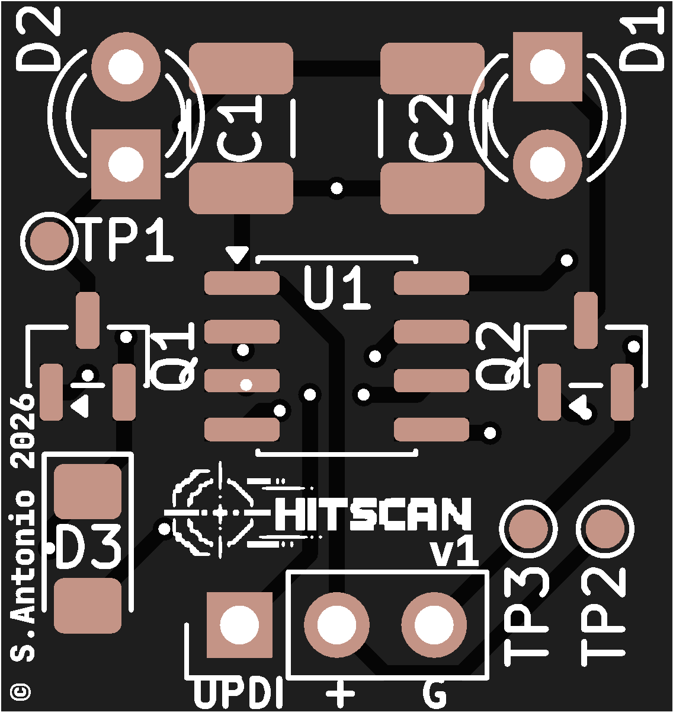

# Hitscan board

> [!CAUTION]
> In development

This board gets mounted on your quad with +5v and GND, it emits a signal for up to 8 racers

Runs on ATTiny402 - fits on a 17.5mm x 18.5mm board

## Setup

Make sure to flash each pcb with different racer id

## What this firmware does

Blasts a single code for a racer over and over, ideally so when we cross our detection window we get at least 3 clean reads at speeds up to 200km/hr

Probably wont work outside in the sun.

## BOM
* [AO3400](https://s.click.aliexpress.com/e/_c3vhLHiB) - Mosfet to drive IR LEDs
* [TSAL4400](https://s.click.aliexpress.com/e/_c3m8pfAJ) - IR LED 100mA
* [ATTiny402](https://s.click.aliexpress.com/e/_c3q55ecr) - 8 pin 20mHz microcontroller
* [1210 SMD Resistors](https://s.click.aliexpress.com/e/_c2uIW28f) - misc resisters
* [UPDI Friend](https://s.click.aliexpress.com/e/_c4tdFiLV) - optional programmer for ATTiny
* [1210 Ceramic Capacitor](https://s.click.aliexpress.com/e/_c4kVavzV) - 0.1uF capacitor
* [1210 Ceramic Capacitor](https://s.click.aliexpress.com/e/_c3ftnBcb) - 100uF capacitor
* [1206 LEDs](https://s.click.aliexpress.com/e/_c4UlNysX) - optional colored LED for status